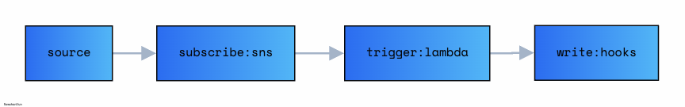
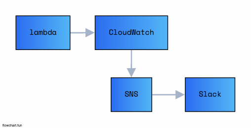
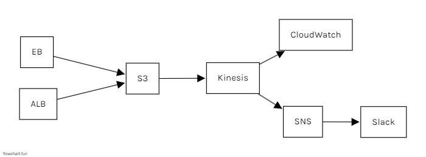

# Simple SNS use Slack

- Notification use AWS SNS send to Slack(webhoooks)

## Desc

- SNS
- Slack

## Result

## UseCase

- [ ] Cloud Watch + Slack
- <a href="https://jforj.tistory.com/293">SNS Notification</a>

- [ ] Case Practice) Labmda + CloudWatch + SNS + Slack

- [ ] Case 1) Simple SNS Slack

- [ ] Case 2) SNS Slack use Kinesis

